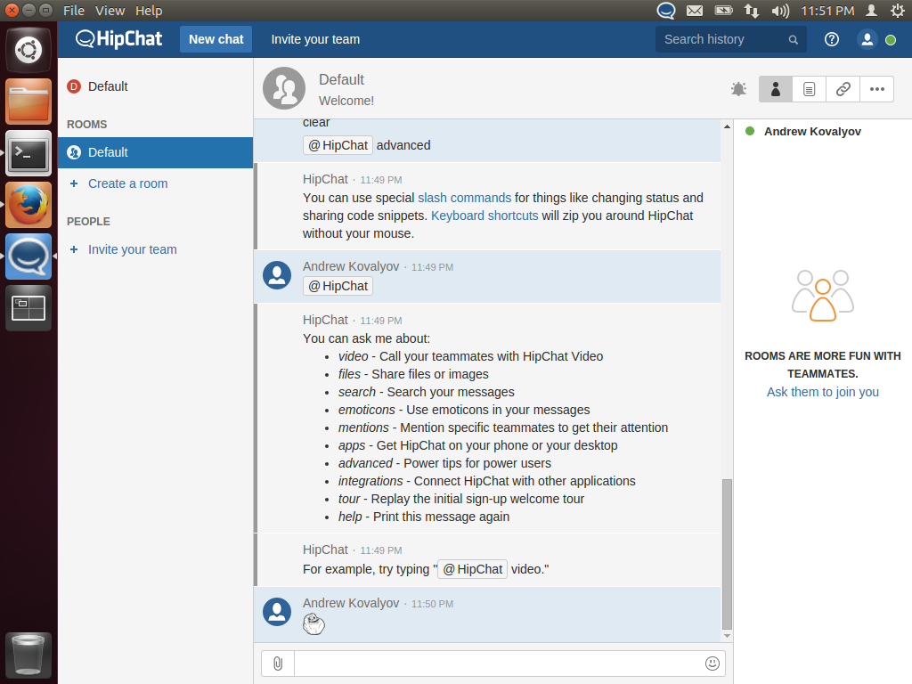

## Hipchat desktop client



#### What

Standalone app with hipchat website access.

Please note, that this app is in early alpha, any issues/ideas/PRs are welcome!

Not affiliated with Atlassian.

#### Why

Currently Linux client for Hipchat has a bunch of old issues which are not solved by Atlassian.
The short list is:
- [Bug](https://help.hipchat.com/forums/138883-suggestions-ideas/suggestions/4013212-linux-client-is-missing-notification-area-icon) [with](https://help.hipchat.com/forums/138883-suggestions-ideas/suggestions/4184974-linux-client-doesn-t-put-the-icon-in-the-system-tr) [trays](https://help.hipchat.com/forums/138883-suggestions-ideas/suggestions/5525589-gnome-shell-system-tray-extension-for-hipchat-like)

- [Shortcuts don't work in non-English layout](https://help.hipchat.com/forums/138883-suggestions-ideas/suggestions/4566565-non-english-layout-does-not-let-copy-paste)

- [UI is not up to date compared to Web and OS X app.](https://flowdock.uservoice.com/forums/36827-general/suggestions/5366511-add-a-linux-desktop-app)

#### Why not Chromium/Firefox app

Web applications have one limitation which is quite important for me - there is no way to minimize it to tray.

#### How

It is possible thanks to atom electron project. This app is based on [really super kit](https://github.com/Aluxian/electron-superkit).

NOTE: There is a known bug with Electron desktop notifications on Linux DE that may crash the app siltenly if notifications are clicked. Until this bug is resolved, do not click on notifications. You can track the progress in https://github.com/akovalyov/hipchat-desktop/issues/1

#### Installation

````sh
$ git clone git@github.com:akovalyov/hipchat-desktop.git
$ cd hipchat-desktop
$ npm install
#optional, for deb packaging
$ bundle install --path vendor/bundle
````

### Launching

```sh
$ gulp watch:linux32 #or 64
```

